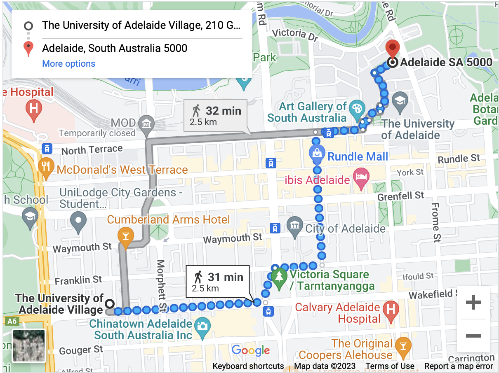

# Cyber Security Research Bootcamp 2023
Welcome to the Cyber Security Research Bootcamp 2023 hosted by the University of Adelaide.

## Outline
The Cyber Security Research Bootcamp runs from Monday 16 January to Wednesday 25 January 2023 at the University of Adelaide, mostly in the Engineering Maths Building, room EM205.

Depending on your experience in research, whether starting out at Honours or Masters, whether starting or completing a PhD, or as an early career researcher, our aim is to build a team with a common but multi-faceted interest in cybersecurity by helping you to:

1. Develop a research proposal
2. Conduct a literature review and critically assess publications
3. Present research - from early stage to final thesis draft - to a receptive peer audience
4. Deliver, receive and work with constructive feedback
5. Work with other researchers in cyber security to form an international peer community
6. Develop international friendships which can lead to new and exciting opportunities.

Social activities include 14-15 January to welcome early international arrivals, 21-22 January wine tasting in the Barossa Valley, and an Australia Day barbecue at the Estonian Consulate. Local participants are encouraged and very welcome to participate in all social events.

## Preparation
The formal program begins on 16 January. You will have an opportunity to introduce yourself and your research interest. You are asked to prepare a pitch presentation of strictly under 7 minutes and no more than 10 slides, outlining:

1. Who you are and your professional/educational experience to date
2. Any previous research experience
3. Your current research project or, if applicable, your research interest
4. What you hope to develop during the bootcamp (this might be developing your
research proposal, finalising a thesis or getting feedback on a paper for publication)

## Dress Code
University student smart casual, except for two formal occasions where business attire would be more appropriate.

## For International Visitors
Accommodation is booked for you at The Village, 210 Grote Street, Adelaide.
[https://adelaidestudenthousing.com.au/properties/the-university-of-adelaide-village/](https://adelaidestudenthousing.com.au/properties/the-university-of-adelaide-village/)
You will be in an apartment with four individual bedrooms and shared common area/kitchen. Laundry facilities are available. Towels and bedding are provided. Toiletries are not provided.
No meals are provided at the accommodation but there is a kitchen for your use.
You are very close to the Adelaide Central Market and one of the main restaurant areas in the city. It is a comfortable 30 minute walk to the University of Adelaide campus.

*Clicking this image will take you to Google Maps.*
  
Power: Australia uses 230V / 50Hz, so European appliances are compatible with an appropriate power adaptor. The power socket is unique to Australia. Adaptors can be purchased before you leave or when you get here.
  
Phones: Roaming is expensive in Australia. We can assist you to purchase a prepaid SIM when you get here.
  
Wifi: available at The Village and on the University of Adelaide campus. Transport: we will collect you from Adelaide Airport unless otherwise arranged.
 
## Weather and Other Considerations for International Visitors
Adelaide has a hot Mediterranean climate in summer (January) with high temperatures and low humidity.

Tap water is safe to drink. You are strongly advised to carry a bottle of water with you and drink water regularly.
You should also follow the Slip Slop Slap Seek and Slide guidelines, because sunburn and sunstroke are significant health risks in our summer, especially at the beach:
• Slip on a shirt: wear a light long-sleeve shirt to protect neck and arms
• Slop on sunscreen: use SPF 50+ sunscreen to protect exposed skin
• Slap on a hat to protect your face and neck
• Seek out shade
• Slide on sunglasses

Adelaide generally has relatively low rates of crime, but you should keep valuables secure in your room. There is a nightclub area – Hindley Street – where the usual personal security precautions should be taken.

## Contacts
- Dr Matthew Sorell, matthew.sorell@adelaide.edu.au or mobile REDACTED
- Dr Richard Matthews, richard.matthews@adelaide.edu.au or mobile +61 (0)414 275 570 
- Emergency: Police/Fire/Ambulance call 000 or (mobile) 112
- On Campus Security: 8313 5990
- University Health Practice: https://universityhealthpractice.com.au, 7095 0273

We can assist with medical, consular and other matters.  

## Modified Chatham House Rule
To facilitate a trusted environment between participants, all presentations during the Cyber Security Research Bootcamp are held under a modified version of the Chatham House Rule:

*“Participants are free to use the information received, but neither the identity or the affiliation of the speaker(s), nor that of any other participant, may be revealed without prior consent or communication of that individual.”*

# Draft Program
The program is currently being finalised and is subject to more detail and some changes.

## Week 1
### Monday 16 January – University of Adelaide
|Time|Event|Comments|Location|
|---|---|---|---|
|08:30| Welcome breakfast reception REDACTED|||
|09:30| Official Opening of the Cyber Security Research Bootcamp 2023|||
|10:00| Coffee|||
|10:15| Introduction and outline of the Cyber Security Research Bootcamp|||
|11:00| Pitch Presentations|Early Career Researchers||
|12:30| Lunch (provided)|||
|13:30| Pitch Presentations|PhD, Masters and Honours students||
|15:30| Coffee|||
|15:45| How to write a research exposé|||
|17:00| Close|||
|||||
|Evening:| Fish and chips||Glenelg Beach|

### Tuesday 17 January – University of Adelaide
|Time|Event|Comments|Location|
|---|---|---|---|
|09:00| Introduction to Kali Linux|||
|10:00| Coffee|||
|10:15| Getting started with your research topic|||
|11:00| Cyber is a human problem|||
|12:30| Lunch (provided)|||
|13:30| Research Proposal Preparation – with Supervisors|||
|15:30| Coffee|||
|15:45| Research Proposal Preparation – continues|||
|17:00| Close|||
|||||
|Evening:| Own arrangements|||

### Wednesday 18 January – University of Adelaide
|Time|Event|Comments|Location|
|---|---|---|---|
|09:00| Introduction to LaTeX|||
|10:00| Coffee|||
|10:15| Guest presentation|||
|11:00| Research Proposal Preparation – with Supervisors| ||
|12:30| Lunch (provided)|||
|13:30| Research Proposal Presentations|||
|15:30| Coffee|||
|15:45| Research Proposal Presentations – continues |||
|17:00| Close|||
|||||
|Evening:| Own arrangements|||

### Thursday 19 January – University of Adelaide
|Time|Event|Comments|Location|
|---|---|---|---|
|09:00|Vulnerabilities in Intel Processors |Presented by [Associate Professor Yuval Yarom](https://cs.adelaide.edu.au/~yval/)||
|10:00| Coffee|||
|10:15| Developing a research proposal|||
|11:00| Apple Watch Forensics CTF |Presented by Luke Jennings||
|12:30| Lunch (provided)
|13:30| Richard Matthews: Conducting a Literature Survey |Presented by [Dr Richard Matthews](https://adelaidecybercrime.org/people)||
|14:30| Work on Literature Survey – with Supervisors |||
|15:30| Coffee|||
|15:45| Work on Literature Survey – continues|||
|17:00| Close|||
|||||
|Evening| Group Dinner|| (venue tbd)|

### Friday 20 January – University of Adelaide and Lot 14 (TBC)
|Time|Event|Comments|Location|
|---|---|---|---|
|09:00| Literature Survey Presentations|||
|10:00| Coffee|||
|10:15| Literature Survey Presentations - continues|||
|11:30| Tour of Nokia 5G Lab (tbc)||Nokia Lab|
|12:30| Lunch (provided)|||
|13:30| Tour of [Australian Institute for Machine Learning](https://www.adelaide.edu.au/aiml/) (tbc)||AIML, Lot 14|
|15:00| Industry engagement event| Hosted by [Australian Cyber Collaboration Centre](https://www.cybercollaboration.org.au)|| 
|17:00| Industry networking reception| hosted by [Australian Cyber Collaboration Centre](https://www.cybercollaboration.org.au)||
|||||
|Evening|Eesti Maja (Estonia House)|[Eesti Maja](https://adelaide.eesti.org.au) (Estonia House) bar is open from 18:30| 200 Jeffcott Street, North Adelaide|

### Saturday 21 January and Sunday 22 January
|Time|Event|Comments|Location|
|---|---|---|---|
||Tours of Adelaide Hills and Barossa Valley are proposed. Details to follow|||

## Week 2
**Timings for the the second week of the program are subject to confirmation of the avalaibility of guest speakers.**

### Monday 23 January - University of Adelaide 
|Time|Event|Comments|Location|
|---|---|---|---|
||Students continue work on research exposé with supervisors |||
||Guest presenters to be confirmed|||
||Lunch and coffee provided|||

### Tuesday 24 January – University of Adelaide
|Time|Event|Comments|Location|
|---|---|---|---|
||Students continue work on research exposé with supervisors |||
||Guest presenters to be confirmed|||
||Lunch and coffee provided|||

### Wednesday 25 January – University of Adelaide
|Time|Event|Comments|Location|
|---|---|---|---|
||Presentation of research exposés|||
||Guest presenters to be confirmed|||
||Lunch and coffee provided|||
|16:30|Close of Cyber Security Research Bootcamp||| 
|Evening| Informal Group Dinner||TBA|

### Thursday 26 January – Consulate of Estonia in South Australia
|Time|Event|Comments|Location|
|---|---|---|---|
||Undisclosed Social Event|||

  
